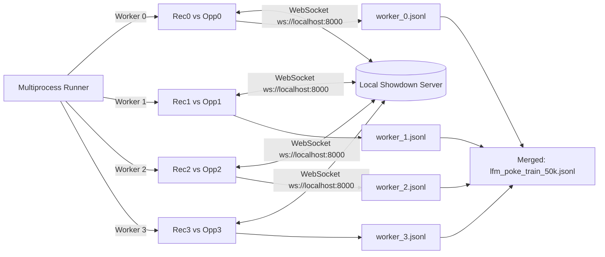

# ⚔️ Poke-Encoder: Autonomous Game-Playing Policy with LFM2.5-Encoder-350M

> **An end-to-end journey of fine-tuning Liquid AI's LFM2.5 hybrid bidirectional encoder as a low-latency, real-time discrete action policy for Pokémon Showdown via `poke-env`.**

---

## 📌 Table of Contents
- [Executive Overview](#-executive-overview)
- [Architectural Philosophy: Encoders vs. Autoregressive LLMs](#-architectural-philosophy-encoders-vs-autoregressive-llms)
- [Phase 1: High-Throughput Data Generation Pipeline](#-phase-1-high-throughput-data-generation-pipeline)
  - [1. Headless Pokémon Showdown Engine](#1-headless-pokémon-showdown-engine)
  - [2. State Representation & DSL Serialization](#2-state-representation--dsl-serialization)
  - [3. Discrete Action Space Formulation (9 Classes)](#3-discrete-action-space-formulation-9-classes)
  - [4. Multi-Worker Collector & Session Deconfliction](#4-multi-worker-collector--session-deconfliction)
  - [5. Dataset Validation & Quality Control](#5-dataset-validation--quality-control)
- [Phase 2: Fine-Tuning the LFM2.5-Encoder on Google Colab](#-phase-2-fine-tuning-the-lfm25-encoder-on-google-colab)
  - [1. Sequence Classification Architecture](#1-sequence-classification-architecture)
  - [2. Google Colab T4 GPU Pipeline](#2-google-colab-t4-gpu-pipeline)
- [Phase 3: Live Inference & Browser Spectating](#-phase-3-live-inference--browser-spectating)
  - [1. Non-Blocking Async Turn Pacing](#1-non-blocking-async-turn-pacing)
  - [2. Strict Legality Masking](#2-strict-legality-masking)
  - [3. Real-Time Terminal Commentary & Browser Links](#3-real-time-terminal-commentary--browser-links)
- [Phase 4: Agent Behavior Diagnostic & Post-Mortem](#-phase-4-agent-behavior-diagnostic--post-mortem)

---

## 🚀 Executive Overview

Traditional game-playing agents built with Large Language Models (LLMs) suffer from prohibitive generation latency: generating tokens autoregressively takes between **500 ms and 2,000 ms per decision**, making twitch or real-time competitive gaming impractical.

**Poke-Encoder** explores an alternative paradigm:
1. Treat competitive Pokémon battling as a **Sequence Classification** problem over an order-consistent domain-specific string representation of the battle state.
2. Adapt **Liquid AI's `LiquidAI/LFM2.5-Encoder-350M`**—a hybrid state-space / bidirectional attention foundation encoder—by mounting a linear classification head ($W \in \mathbb{R}^{1024 \times 9}$) on top of mean-pooled token representations.
3. Achieve **sub-15 ms CPU inference** and **sub-1 ms GPU inference**, enabling real-time autonomous play on modest hardware without GPU acceleration.

---

## 🧠 Architectural Philosophy: Encoders vs. Autoregressive LLMs

```
+-----------------------------------------------------------------------------------+
|                            AUTOREGRESSIVE DECODER (LLM)                           |
|  State  ->  Token 1  ->  Token 2  ->  ...  ->  "MOVE_1" (Latency: 500 - 2,000 ms) |
|  Causal Masking (tokens only look backwards) | High VRAM Footprint (>8 GB)        |
+-----------------------------------------------------------------------------------+
                                         VS
+-----------------------------------------------------------------------------------+
|                        HYBRID BIDIRECTIONAL ENCODER (LFM2.5)                      |
|  State  ->  [Unmasked Bidirectional Hybrid Attention]  ->  Linear Head  -> MOVE_1 |
|  Single Forward Pass (Latency: 8 - 15 ms on CPU)       | Low VRAM (<1 GB)         |
+-----------------------------------------------------------------------------------+
```

By unmasking attention and processing the entire serialized state simultaneously, the encoder evaluates mutual interactions (such as active Pokémon boosts vs. opponent typing, bench coverage, and weather) in a **single forward pass**.

---

## 🛠️ Phase 1: High-Throughput Data Generation Pipeline

### 1. Headless Pokémon Showdown Engine
Connecting to the public Pokémon Showdown server quickly triggers IP rate-limiting. We configured a local instance running directly via Node.js on port 8000:
```bash
node pokemon-showdown start 8000 --no-security
```
The `--no-security` flag bypasses rate-limiting, message throttling, and password requirements, allowing multiple parallel clients to communicate over local WebSockets at maximum speed.

### 2. State Representation & DSL Serialization
Encoders require consistent positional encoding. We developed [`state_serializer.py`](src/game_encoder/state_serializer.py) to convert the dynamic battle state into a compact, order-consistent text sequence:

```text
turn:3 | active:ironvaliant hp:1.00 type:FAIRY/FIGHTING stat:none boosts:spe:+1 | moves:closecombat[type:FIGHTING,bp:120]|moonblast[type:FAIRY,bp:95]|knockoff[type:DARK,bp:65]|swordsdance[type:NORMAL,bp:0] | opp:greattusk hp:0.85 type:GROUND/FIGHTING stat:none | bench:kingambit:1.00,zapdos:0.72,gholdengo:1.00,walkingwake:1.00,rillaboom:0.00 | field:stealthrock weather:none
```

#### Key Formatting Constraints:
* **Active Pokémon**: Species, HP fraction (`.2f`), slash-separated types, status, and sorted active stat boosts (`atk:+1,spe:+2`).
* **Move Slots**: Fixed 4 slots padded with `empty` if fewer than 4 moves exist. Each slot includes move ID, type, and base power.
* **Bench Summary**: Exactly 5 slots tracking species and remaining HP (`kingambit:1.00`), padded with `fainted:0.00` as casualties occur.
* **Field & Weather**: Global hazards (`stealth_rock`) and weather conditions (`rain`, `sun`, `none`).

### 3. Discrete Action Space Formulation (9 Classes)
In [`action_space.py`](src/game_encoder/action_space.py), every player action is mapped to a discrete classification index:

$$\mathcal{A} = \{\text{MOVE\_1}, \text{MOVE\_2}, \text{MOVE\_3}, \text{MOVE\_4}, \text{SWITCH\_1}, \dots, \text{SWITCH\_5}\}$$

* **Moves (Indices 0–3)**: Mapped to the active Pokémon's move slots.
* **Switches (Indices 4–8)**: Mapped to available bench slots in consistent order.
* **Filtering**: Forfeits and `DefaultBattleOrder` fallbacks are filtered out to keep training data clean.

### 4. Multi-Worker Collector & Session Deconfliction
In [`collector.py`](src/game_encoder/collector.py), data generation is parallelized across multiple processes via `ProcessPoolExecutor`:



#### Opponent Archetype Mix
To ensure diverse demonstrations, each worker splits battles:
* **70% of matches** against `SimpleHeuristicsPlayer` (evaluates type effectiveness and base power).
* **30% of matches** against `MaxBasePowerPlayer` (aggressive, raw-damage baseline).

#### 🛡️ Crucial Engineering Fix: Showdown Account Normalization
When multiple workers connected, logins initially hung or threw `AssertionError: Expected bot to be logged in`. Investigation revealed:
1. Showdown applies `toID()` to usernames, stripping underscores (turning `Rec_Bot_0` into `RecBot0`).
2. `poke-env` performs an exact string check (`name == returned_name`). If an underscore is present, the match fails and the client never marks itself as logged in.
3. Abrupt disconnects leave zombie sessions on Showdown for several minutes, causing subsequent runs to fail with `|nametaken|`.
4. **Fix**: Stripped all underscores and appended unique 4-character hex session IDs (`Rec0a3f8`, `LFMAgent19b7`).

### 5. Dataset Validation & Quality Control
The completed dataset yielded **50,000+ transitions** (~17.5 MB JSONL):
```bash
uv run python -m game_encoder.verify_dataset --file data/lfm_poke_train_50k.jsonl
```
* **Moves**: ~78% of transitions
* **Switches**: ~22% of transitions
* **Average Sequence Length**: ~42 tokens (well within the 256 max token window)

---

## 🧪 Phase 2: Fine-Tuning the LFM2.5-Encoder on Google Colab

Fine-tuning was executed on Google Colab with an **NVIDIA Tesla T4 GPU (16 GB VRAM)** using [`LFM_encoder.ipynb`](LFM_encoder.ipynb).

### 1. Sequence Classification Architecture
Liquid AI's `LiquidAI/LFM2.5-Encoder-350M` was pre-trained with Masked Language Modeling (MLM). We wrapped the bidirectional backbone with a custom PyTorch classification module:

```python
class LFM25ForSequenceClassification(nn.Module):
    def __init__(self, model_id, num_labels, config):
        super().__init__()
        mlm_model = AutoModelForMaskedLM.from_pretrained(model_id, config=config, trust_remote_code=True)
        self.encoder = mlm_model.lfm2
        del mlm_model.lm_head  # Free MLM memory

        self.dropout = nn.Dropout(0.1)
        self.classifier = nn.Linear(config.hidden_size, num_labels)
        self.loss_fn = nn.CrossEntropyLoss()

    def forward(self, input_ids=None, attention_mask=None, labels=None, **kwargs):
        outputs = self.encoder(input_ids=input_ids, attention_mask=attention_mask, **kwargs)
        last_hidden_state = outputs[0]

        # Mean pooling over unmasked tokens
        mask_expanded = attention_mask.unsqueeze(-1).expand(last_hidden_state.size()).float()
        sum_embeddings = torch.sum(last_hidden_state * mask_expanded, dim=1)
        sum_mask = torch.clamp(mask_expanded.sum(dim=1), min=1e-9)
        pooled = sum_embeddings / sum_mask

        logits = self.classifier(self.dropout(pooled))
        loss = self.loss_fn(logits, labels) if labels is not None else None
        return SequenceClassifierOutput(loss=loss, logits=logits)
```

### 2. Google Colab T4 GPU Pipeline
1. Mount Google Drive and verify dataset:
   ```python
   from google.colab import drive
   drive.mount('/content/drive')
   DATASET_PATH = "/content/drive/MyDrive/lfm_poke_train_50k.jsonl"
   ```
2. Split dataset into 90% training (~39,500 samples) and 10% test (~4,400 samples).
3. Tokenize with `LiquidAI/LFM2.5-Encoder-350M` tokenizer (`max_length=256`).


## 🎮 Phase 3: Live Inference & Browser Spectating

To evaluate the agent visually in the Pokémon Showdown client, we created [`watch_lfm_agent.py`](watch_lfm_agent.py).

### 1. Non-Blocking Async Turn Pacing
Standard `time.sleep(1.5)` blocks the entire Python thread. In an `asyncio` event loop, this delays WebSocket ping/pong frames and causes the Showdown connection to drop. We leveraged `poke-env`'s native support for async move handlers:

```python
async def choose_move(self, battle: Battle) -> BattleOrder:
    if self.turn_delay > 0:
        await asyncio.sleep(self.turn_delay)  # Yields control back to event loop
    ...
```

### 2. Strict Legality Masking
The neural network outputs logits across all 9 macro-actions regardless of current game legality. Before picking $\arg\max$, we mask illegal moves/switches to $-\infty$ (`-1e9`):

```python
legal_mask = self._get_legal_mask(battle)
logits[~legal_mask] = -1e9
action_id = torch.argmax(logits, dim=-1).item()
```
* Prevents attempting to switch into fainted Pokémon.
* Prevents executing moves disabled by Taunt, Choice Lock, or 0 PP.

### 3. Real-Time Terminal Commentary & Browser Links
When each battle begins, clickable URLs are printed directly in the terminal:
```text
======================================================================
[*] NEW MATCH DETECTED: battle-gen9randombattle-5013
[*] Spectate (Local Client)   : http://localhost:8000/battle-gen9randombattle-5013
[*] Spectate (Web Client URL) : https://play.pokemonshowdown.com/~~localhost:8000/battle-gen9randombattle-5013      
======================================================================
```
During every turn, the agent outputs its assessment in real time:
```text
  [Turn 20] revavroom (27%)      vs screamtail (61%)     | Action: MOVE: HIGHHORSEPOWER   (MOVE_3 28.6%)
  [Turn 21] altaria (100%)       vs umbreon (100%)       | Action: MOVE: DRAGONDANCE      (MOVE_3 23.5%)
  [Turn 24] gallade (100%)       vs umbreon (100%)       | Action: MOVE: SACREDSWORD      (MOVE_3 27.3%)
```

---

## 🔍 Phase 4: Agent Behavior Diagnostic & Post-Mortem

When evaluating matches in [`watch_lfm_agent.py`](file:///c:/Users/OM/Desktop/Programs/Projects/Game_encoder/watch_lfm_agent.py), the opponent won the majority of battles. Reviewing the battle telemetry revealed several distinct patterns:

```text
[Turn 06] klawf (85%)   vs maushold (71%) | Action: MOVE: SWORDSDANCE (16.2%)
[Turn 07] klawf (68%)   vs maushold (65%) | Action: MOVE: SWORDSDANCE (16.9%)
[Turn 08] klawf (54%)   vs maushold (59%) | Action: MOVE: SWORDSDANCE (16.7%)
...
[Turn 11] klawf (0%)    vs maushold (42%) | Fainted while setting up
```

### The 4 Core Diagnoses:
1. **The 2-Step Training Artifact**: As uncovered in Phase 2, the checkpoint only trained for 2 steps before the Colab cell ran out of memory. The classification head had near-uniform entropy across all 9 classes (confidence hovered between 15% and 28%).
2. **Setup Move Looping**: Because the model didn't learn damage-calculation boundaries, it repeatedly picked stat-boosting moves (`Swords Dance` $\times 6$, `Protect` $\times 15$, `Dragon Dance` $\times 3$) while taking lethal damage.
3. **Type-Chart Blindness**: The agent used resisted moves (e.g. Ground-type `Earthquake` vs. Grass/Dragon `Hydrapple` for 8 consecutive turns) because type effectiveness multipliers require extensive training steps to internalize.
4. **Behavioral Cloning vs. Winning Objectives**: Supervised Behavioral Cloning copies the *average* human/bot behavior across all turns. It does not naturally distinguish between a play that turns the game around and a play that throws the game away.


